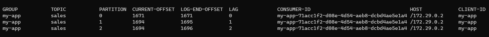

# KAFKA CLUSTER

## How to run?
    docker-compose up -d

## How to stop the service?
    docker-compose down
    
## How to test Fail-over
    docker-compose stop kafkaX
    change ´X´ for the number of broker(kafka1,kafka2 or kafka3)

## create a replicated topic
    /opt/bitnami/kafka/bin/kafka-topics.sh --create --bootstrap-server localhost:9092 --topic sales --partitions 3 --replication-factor 3

## Describe topic
    /opt/bitnami/kafka/bin/kafka-topics.sh --describe --bootstrap-server localhost:9092 --topic sales

## Describe all consumers groups
    /opt/bitnami/kafka/bin/kafka-consumer-groups.sh  --bootstrap-server localhost:9092 --describe --all-groups

## How to list topics
    /opt/bitnami/kafka/bin/kafka-topics.sh --bootstrap-server localhost:9092 --list

# Kafka Architecture
    Zookepers: 3
    Partitions: 3 
    Replication Factor: 3
    Topic: "sales"
    Broker: 3 Brokers(kafka1,kafka2,kafka3)
    Producer: "producer-app" 
    Consumer: "consumer-app"
Both application(consumer/producer) was coding with nodeJs using kafkaJs library
    
## Kafka architecture has 4 actors. These are:
* Broker
* Zookeeper
* Producer(writes data to Kafka.)
* Consumer(reads data from Kafka)

## Zookeeper 
Is open-source software. Kafka uses Zookeeper to manage all Brokers. The data sent is never stored here. Zookeeper’s responsibilities are:
Coordinating brokers.
* Choosing the Leader Partition.
* To ensure that brokers get to know each other.
* Discovering new or deleted Brokers or newly added, changed Topics.

# Partitions
The data in the partition is not stored here forever. Kafka has two storage configurations. 
These are:
* Time-based retention (e.g. 7 days)
* Data size based storage (e.g. 100 GB)

For more information about kafka please see [here](https://github.com/bitnami/bitnami-docker-kafka/blob/master/README.md)
